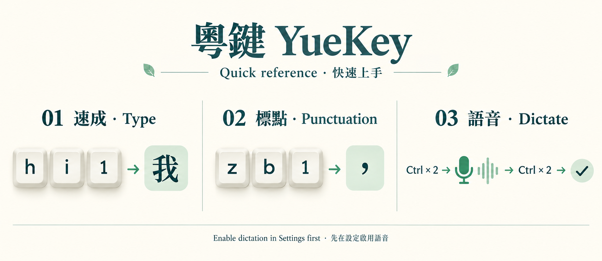
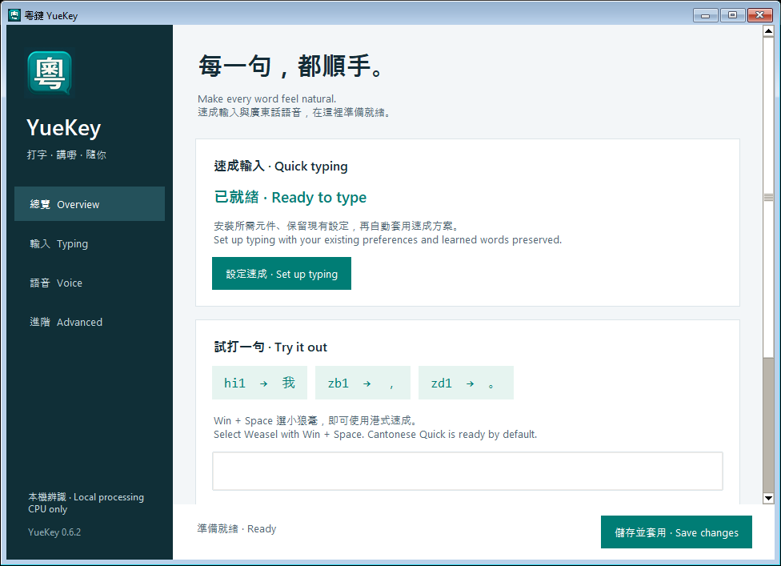
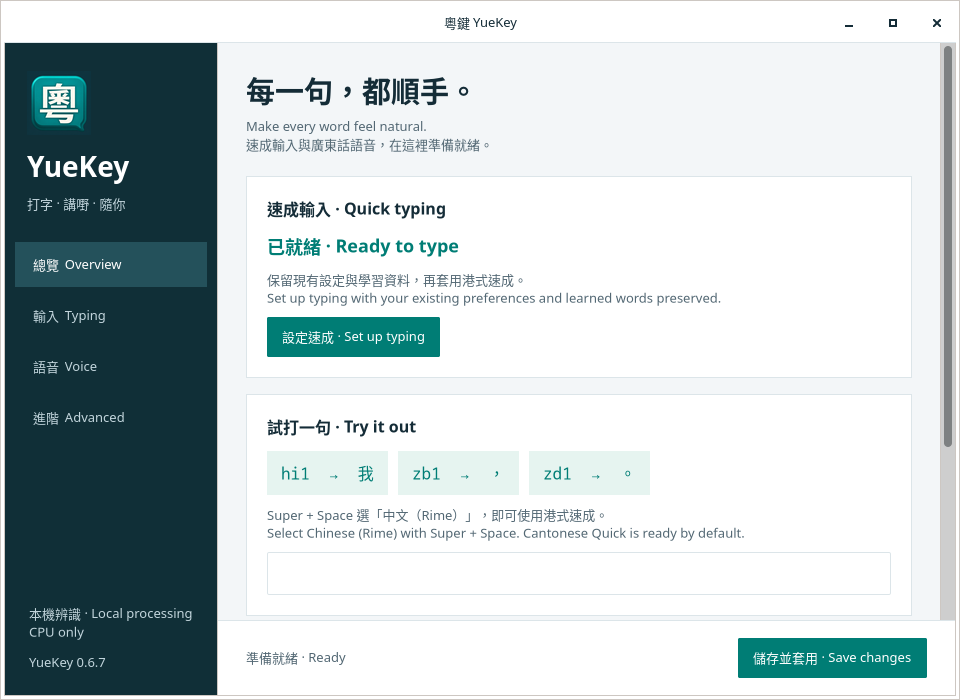

<p align="center"></p>

# 粵鍵 YueKey


[](https://github.com/angusleung-armitage/YueKey/actions/workflows/ci.yml) [](LICENSE)

**在 Ubuntu、Kubuntu 和 Windows 打速成，講廣東話。**  
**Quick typing. Cantonese dictation. For Ubuntu, Kubuntu and Windows.**

粵鍵是一套為香港用字及廣東話日常輸入而設的開源輸入工具。用熟悉的速成首尾碼打字，或連按兩次 Ctrl，直接講出你想寫的內容。打字和語音辨識都在電腦本機處理。

YueKey is an open-source input tool for Hong Kong Chinese and everyday Cantonese. Type with first-and-last Cangjie codes, or double-tap Ctrl and dictate. Both typing and speech recognition run locally on your computer.

[平台功能 · Platform features](docs/platform-parity.md) · [免費下載 · Free downloads](https://github.com/angusleung-armitage/YueKey/releases) · [Ubuntu 安裝](docs/INSTALL.md) · [Windows installation](docs/WINDOWS.md) · [開始使用 · Get started](#get-started) · [語音輸入 · Dictation](#dictation) · [常見問題 · Troubleshooting](docs/INSTALL.md#troubleshooting)

## 為甚麼用粵鍵？ · Why YueKey?

| 功能 | 中文 | English |
| --- | --- | --- |
| ⌨️ 速成輸入 · Quick input | 首尾碼打字、數字選字、空白鍵確認，支援一碼及兩碼。 | One- and two-letter Quick codes, numbered candidates and Space to confirm. |
| 🇭🇰 香港用字 · Hong Kong characters | 支援嘅、喺、唔、冇、咗、啲、嚟、㗎、𨋢等字。 | Includes characters used in everyday Hong Kong Chinese and Cantonese. |
| 💬 關聯字 · Word continuations | 按廣東話詞頻提供候選字及關聯字，並在本機學習你的選字習慣。 | Cantonese frequency data, related-word suggestions and local candidate learning. |
| 🎙️ 廣東話語音 · Cantonese dictation | GNOME／KDE／Windows 下連按兩次 Ctrl 開始／停止，輸出香港繁體字，可加入標點。 | Double Ctrl starts/stops dictation on GNOME, KDE and Windows, with HK Traditional output and optional punctuation. |
| 🖥️ 純 CPU · CPU only | 使用 SenseVoice Small Yue INT8，無需 GPU 或雲端語音帳戶。 | SenseVoice Small Yue INT8 runs on the CPU, without a GPU or cloud speech account. |
| 🎨 可調校外觀 · Your preferred layout | 候選字橫排／直排、字體大小、每頁字數及淺色／深色主題。 | Adjust candidate orientation, font size, page size and light/dark appearance. |

### 用你的方式輸入 · Choose how to write



```text
速成 Quick        hi → 選擇／select 我
香港用字 HK       rf → 選擇／select 喺
標點 Punctuation  zb → ，    zd → 。    zi → ？    zj → ！
語音 Dictation    Ctrl × 2 → 講廣東話／speak → Ctrl × 2 → 插入文字／insert text
```

速成碼可能對應多個字，選字次序會受詞頻及個人學習影響。語音例子只說明操作方式；辨識結果會隨錄音而異。

完整的 75 個傳統 `z` 符號及候選順序見[標點對照表 · Punctuation reference](docs/PUNCTUATION.md)。

Quick codes can match several characters; frequency data and personal learning affect their order. The dictation example describes the interaction, not a guaranteed transcript.

關聯字只顯示在清單：選出「你」後，文字欄仍然是「你」；選取「講」後才成為「你講」。可用數字鍵或 Space 確認，Esc 取消。

Continuations stay in the list: after selecting 你, the field still reads 你. It becomes 你講 only after you select 講. Confirm with a number key or Space; Esc dismisses suggestions.

### Windows：一次安裝，準備就緒 · One setup, ready to type

Windows 安裝檔已包含小狼毫引擎並自動部署速成。全新介面分為總覽、輸入、語音及進階；儲存設定時會自動套用，亦可在總覽直接試打。

Windows setup includes the Weasel engine and deploys Cantonese Quick automatically. The redesigned app has Overview, Typing, Voice and Advanced pages, automatic deployment when saving, and a practice field.



*實際 Windows x64 安裝後截圖；視窗邊框依系統主題而異。Actual installed Windows x64 app; window borders follow the system theme.*

### Ubuntu／Kubuntu：相同版面 · A familiar layout

Linux 與 Windows 共用總覽、輸入、語音及進階四頁、深綠導覽列和設定卡片。13 項偏好使用相同中英名稱；頁面之間切換不會丟失未儲存選項。執行 `quick-hk configure` 開啟，升級後重新開啟視窗即可使用新介面，毋須登出。

Linux and Windows share four pages, the dark green sidebar and settings cards. All 13 preferences use the same bilingual names, and switching pages keeps unsaved changes. Open `quick-hk configure`; after upgrading, reopen the window to use the new interface without signing out.



*Ubuntu 26.04 GTK 介面的獨立測試截圖；非生成圖片。GTK app captured in an isolated Ubuntu 26.04 test display; not a generated mockup.*

## 支援平台 · Supported platforms

每個平台／CPU 使用專用安裝檔。Linux 的 **all-in-one DEB** 包含速成、設定、GNOME／KDE 整合、CPU 語音執行環境及模型；安裝時由 APT 處理系統依賴。

Choose the installer for your OS and CPU. Each Linux **all-in-one DEB** includes typing, settings, GNOME/KDE integration, the CPU speech runtime and models. APT installs the required system libraries.

| 系統及 CPU · OS / CPU | 下載檔案 · Download (0.6.9) |
| --- | --- |
| Ubuntu / Kubuntu 26.04 · Intel / AMD 64-bit | `yuekey_0.6.9-1_amd64.deb` |
| Ubuntu 26.04 · ARM64 / AArch64 · GNOME 50 or KDE | `yuekey_0.6.9-1_arm64.deb` |
| Windows · Intel / AMD 64-bit | `YueKey-0.6.9-windows-x64-setup.exe` |
| Windows · Intel / AMD 32-bit (x86) | `YueKey-0.6.9-windows-x86-setup.exe` |
| Windows 11 · ARM64 | `YueKey-0.6.9-windows-arm64-setup.exe` |

**[下載安裝檔及 SHA256SUMS · Download installers and checksums](https://github.com/angusleung-armitage/YueKey/releases/latest)** · [詳細架構與驗證範圍 · Architecture and test coverage](docs/ARCHITECTURES.md)

Linux 可執行 `dpkg --print-architecture` 選檔；Windows 到「設定 → 系統 → 關於 → 系統類型」。Ubuntu 26.04 沒有 32-bit x86 桌面版本；目前不提供 Linux i386 或 ARM32 安裝檔。此 DEB 針對 26.04，不適用於所有 Ubuntu／Debian 版本。

On Linux, use `dpkg --print-architecture`. On Windows, check **Settings → System → About → System type**. Ubuntu 26.04 has no 32-bit x86 desktop edition. Linux i386 and ARM32 installers are currently unavailable. These DEBs target 26.04; they are not universal across Ubuntu/Debian releases.

語音辨識可能出錯；完整桌面及應用程式的驗證範圍見[相容性紀錄](docs/compatibility.md)。Windows 安裝檔已包含小狼毫 Weasel，並會自動設定速成；首次啟用語音時才下載模型。

Recognition can make mistakes. See the [compatibility record](docs/compatibility.md) for desktop/application coverage. Windows setup includes Weasel and configures typing automatically. Speech models download when first enabled.

<a id="get-started"></a>
## 開始使用 · Get started

1. **下載 · Download** — 由 Releases 選擇上表對應安裝檔，核對 `SHA256SUMS`。Choose your installer above and verify its checksum.
2. **安裝 · Install** — Windows 執行 EXE，允許安裝小狼毫及設定鍵盤識別圖示所需的管理員提示。詳見 [Windows 指南](docs/WINDOWS.md)。Linux 在下載目錄執行下列指令。On Windows, run the EXE and approve the administrator prompts for the typing engine and shared keyboard icon. See the [Windows guide](docs/WINDOWS.md). On Linux, run these commands in your downloads folder:

```bash
# Ubuntu / Kubuntu 26.04: chooses amd64 or arm64 automatically
sudo apt install ./yuekey_0.6.9-1_$(dpkg --print-architecture).deb
quick-hk setup
quick-hk configure
```

3. **開始打字／講嘢 · Start writing** — 選 Rime → 港式速成。在設定啟用語音後，連按兩次 Ctrl 開始／停止。Select Rime → 港式速成. Enable dictation in settings, then double-tap Ctrl to start/stop.

GNOME 使用 `--frontend ibus`；KDE 使用 `--frontend fcitx5` 可明確指定桌面。詳細啟用及[首次免登出步驟](docs/INSTALL.md#live-activation)見[中英安裝指南](docs/INSTALL.md)。

Use `--frontend ibus` for GNOME or `--frontend fcitx5` for KDE to choose explicitly. See the [bilingual Linux guide](docs/INSTALL.md) for activation and [first-time setup without signing out](docs/INSTALL.md#live-activation).

在 **設定 → 鍵盤 → 輸入來源** 加入 **Chinese (Rime)**，切換至 Rime，即可使用預設的 **港式速成**；只有這一個方案，毋須按 F4。設定介面可用以下指令開啟：

Add **Chinese (Rime)** under **Settings → Keyboard → Input Sources**. Switch to Rime: **港式速成** is the default and only scheme, so no F4 selection is needed. Open the settings window with:

```bash
quick-hk configure
```

> **名稱與相容性 · Naming and compatibility**  
> 產品名稱為 **粵鍵 YueKey**。新套件名稱為 `yuekey`；指令沿用 `quick-hk`，Rime 選單中的方案名稱沿用 **港式速成**，讓既有設定及學習資料繼續使用。  
> The product is **YueKey**. The package is now `yuekey`; commands remain `quick-hk`, and the Rime scheme remains **港式速成**, preserving compatibility with existing settings and learned data.

<a id="dictation"></a>
## 用廣東話講出來 · Say it in Cantonese

在 GNOME 或 [KDE](docs/INSTALL.md#kde) 啟用[已包含的語音功能](docs/INSTALL.md#dictation-setup)後：

For Windows, follow the [companion setup](docs/WINDOWS.md#3-廣東話語音--cantonese-dictation). The steps below describe Ubuntu.

After enabling the [bundled speech feature](docs/INSTALL.md#dictation-setup) on GNOME or [KDE](docs/INSTALL.md#kde):

1. 選擇 **港式速成**，點選文字欄，完成未確認的速成碼。  
   Select **港式速成**, focus a text field and finish any pending character code.
2. 連按兩次 **左 Ctrl**，看到收音提示後開始講話。  
   Double-tap **Left Ctrl** and speak when the recording indicator appears.
3. 再連按兩次 **左 Ctrl**，停止錄音並插入辨識文字。  
   Double-tap **Left Ctrl** again to stop and insert the transcript.
4. 按 **Esc** 取消；切換文字欄或按其他打字鍵亦會取消。  
   Press **Esc** to cancel. Changing fields or typing another key also cancels.

每次最多錄音兩分鐘。可在設定選擇麥克風、左右 Ctrl 及自動標點；如左 Ctrl 已用作中英切換，語音會改用右 Ctrl。

Each recording lasts up to two minutes. Choose the microphone, Ctrl key and automatic punctuation in settings. If Left Ctrl already switches Chinese/English, dictation uses Right Ctrl.

收音時，小咪高峰會顯示在文字游標或輸入欄旁。若程式沒有提供位置，提示會放在目前視窗邊緣。Windows 中文模式的語言列／系統匣圖示為「港」，英文為「A」。

A small microphone appears beside the caret or input field while recording. If an application provides no position, it stays near the active window's edge. Windows uses **港** for Chinese mode and **A** for English in the language bar/tray.

Windows 右邊的鍵盤識別圖示為「中」（英文鍵盤在這個位置顯示 ENG）；左邊「港／A」表示目前輸入模式。

The separate Windows keyboard identifier shows **中**, in the position where an English keyboard shows **ENG**. The **港/A** icon beside it indicates the current input mode.

## 本機處理，保留私隱 · Local by design

- 打字、選字學習及語音辨識均在本機進行；下載安裝檔及系統依賴需要網絡；Linux DEB 已包含模型。Windows 首次啟用另需下載模型。  
  Typing, candidate learning and recognition are local. Downloading installers and system dependencies needs Internet access. Linux DEBs include models; Windows downloads models on first speech setup.
- 語音錄音及待插入的辨識文字只在記憶體暫存，工具不會將它們寫入記錄檔。  
  Captured audio and pending transcripts stay in memory; the tool does not log them.
- 無按鍵遙測，無網絡預測。部署會備份設定；解除部署會保留學習資料及使用者修改。  
  No keystroke telemetry or network prediction. Deployment backs up configuration; removal preserves learned data and user edits.

## 一起改善粵鍵 · Help improve YueKey

歡迎分享錯碼、用字建議、安裝問題及不同應用程式的使用結果。回報時請附上系統版本、桌面環境、應用程式名稱、重現步驟及以下診斷結果；貼出前先檢查是否包含個人路徑。

Contributions and reports are welcome: incorrect codes, vocabulary suggestions, installation problems and application compatibility. Include your OS, desktop, application, reproduction steps and the diagnostics below. Review personal paths before sharing the output.

```bash
quick-hk doctor --frontend ibus
quick-hk dictation status --json
```

KDE 使用者可把 `ibus` 改成 `fcitx5`；兩個桌面均支援語音診斷。  
KDE users can replace `ibus` with `fcitx5`; both desktops support speech diagnostics.

如果粵鍵幫到你，歡迎 Star 專案、分享給有需要的朋友，或一起貢獻程式與用字資料。  
If YueKey helps you, star the project, share it with someone who needs Cantonese input, or contribute code and vocabulary improvements.

## 開源與鳴謝 · Open source and credits

粵鍵使用 Rime、IBus、Fcitx5、公開倉頡／速成／粵語資料，以及 sherpa-onnx、SenseVoice、Silero VAD、CT-Transformer 和 OpenCC。原創程式碼採用 **MIT**；字典並非 MIT，各項第三方程式、模型及資料保留原有授權。

YueKey builds on Rime, IBus, Fcitx5, open Cangjie/Quick/Cantonese data, sherpa-onnx, SenseVoice, Silero VAD, CT-Transformer and OpenCC. Original code is licensed under **MIT**. The dictionaries are not MIT; third-party code, models and data retain their respective licenses.

[授權 · License](LICENSE) · [來源與鳴謝 · Attribution](THIRD_PARTY.md) · [架構 · Architecture](docs/architecture.md) · [測試 · Validation](docs/compatibility.md)
