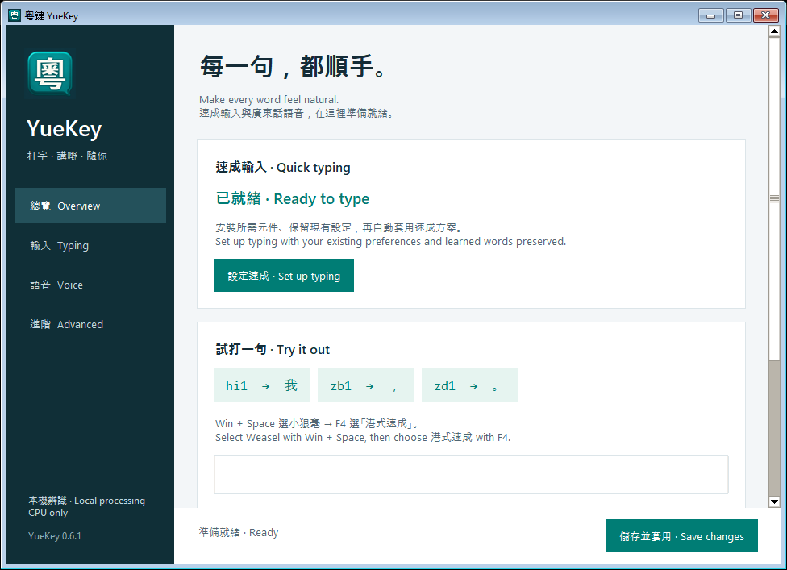

# 粵鍵 YueKey — Windows 安裝 · Windows installation

[← 返回介紹 · Back to README](../README.md)

提供 Windows x64、x86（32 位元）及 ARM64 安裝檔：港式速成、標點符號、本機選字學習、關聯字、完整輸入設定，以及選配的純 CPU 廣東話語音輸入。x64／x86 最低為 Windows 10 2004；ARM64 最低為 Windows 11。測試範圍見[架構指南](ARCHITECTURES.md)。

YueKey provides native x64, x86 (32-bit) and ARM64 Windows builds: Cantonese Quick typing, punctuation, local candidate learning, word continuations, typing settings and optional CPU-only Cantonese dictation. x64/x86 installers require Windows 10 2004 or newer; ARM64 requires Windows 11. See the [architecture guide](ARCHITECTURES.md) for test coverage.

「設定 → 系統 → 關於 → 系統類型」會顯示處理器架構。選擇 `windows-x64`、`windows-x86` 或 `windows-arm64`。下方檔名以 x64 為例；ARM64 必須使用 ARM64 安裝檔。每種架構都包含 CPU 語音執行環境。

Check **Settings → System → About → System type** and choose `windows-x64`, `windows-x86` or `windows-arm64`. Filenames below use x64 as an example. Choose the ARM64 build on ARM64 Windows. Each architecture includes the CPU speech runtime.



## 1. 免費下載 · Free download

到 [GitHub Releases](https://github.com/angusleung-armitage/YueKey/releases) 下載 **`YueKey-0.6.1-windows-x64-setup.exe`** 及 `SHA256SUMS`。開啟安裝程式，按步驟完成；之後可從開始功能表開啟 **YueKey**。程式安裝於目前使用者的 `%LOCALAPPDATA%\Programs\YueKey`，粵鍵本身採每使用者安裝；首次安裝內置小狼毫引擎時會要求 Windows 管理員權限。

Download **`YueKey-0.6.1-windows-x64-setup.exe`** and `SHA256SUMS` from [GitHub Releases](https://github.com/angusleung-armitage/YueKey/releases). Run setup, then open **YueKey** from the Start Menu. Installation is per user, under `%LOCALAPPDATA%\Programs\YueKey`, with an administrator prompt only when the bundled Weasel engine needs to be installed.

在 PowerShell 檢查安裝檔的 SHA-256，與下載頁的 `SHA256SUMS` 比對：<br>
Compare the installer's SHA-256 with `SHA256SUMS` in PowerShell:

```powershell
Get-FileHash .\YueKey-0.6.1-windows-x64-setup.exe -Algorithm SHA256
```

亦提供 **`YueKey-0.6.1-windows-x64.zip`** 免安裝版本。解壓整個資料夾後開啟 `YueKey.exe`，保留旁邊的 `_internal` 資料夾。ZIP 與安裝版包含相同程式及 CPU 執行環境。

The optional **`YueKey-0.6.1-windows-x64.zip`** is a portable edition. Extract the entire folder, keep `_internal` beside `YueKey.exe`, and open the executable. Both editions include the same application and CPU runtime.

此版本未有 Windows 程式碼簽署憑證，系統可能顯示發行者未經驗證。請只使用本專案 Release 的檔案及檢查碼。

This release is not code-signed; Windows may show an unverified publisher. Use this project's release assets and verify their checksums.

## 2. 安裝速成 · Install typing

1. 執行 YueKey setup EXE。安裝檔已內置官方 **小狼毫 Weasel 0.17.4**，毋須另行下載。如尚未安裝，請允許 Windows 管理員提示；已安裝的相容版本會直接沿用。<br>
   Run the YueKey setup EXE. It includes official **Weasel 0.17.4**, so no separate download is needed. Approve the administrator prompt if the engine is missing; compatible existing installations are reused.
2. 安裝程式會為目前使用者建立輸入資料夾、備份原有設定、加入速成方案並自動重新部署。預設資料夾是 `%APPDATA%\Rime`；如小狼毫已設定自訂位置，粵鍵會自動沿用。<br>
   Setup creates the current user's typing folder, backs up existing preferences, installs the Quick scheme and deploys it automatically. It uses `%APPDATA%\Rime` or the custom folder already configured in Weasel.
3. 開啟 **YueKey → 總覽 Overview**，確認「已就緒」。按 **Win + Space** 選小狼毫，在文字欄按 **F4** 選 **港式速成**。可直接在總覽試打 `hi1` → `我`、`zb1` → `，`、`zd1` → `。`。<br>
   Open **YueKey → Overview** and check **Ready to type**. Select Weasel with **Win + Space**, then choose **港式速成** with **F4** in a text field. Try `hi1` → `我`, `zb1` → `，`, and `zd1` → `。` in the practice field.

免安裝 ZIP 亦包含相同引擎安裝檔。首次開啟後，在「總覽」按 **設定速成 · Set up typing**，完成相同設定流程。ZIP 免安裝的是粵鍵程式；Windows 輸入法引擎仍需註冊到系統。

The portable ZIP includes the same engine installer. Choose **Overview → Set up typing** on first use. The companion is portable; Windows typing still requires system registration of its input-method engine.

小狼毫提供 Windows 輸入法整合；粵鍵提供速成字典、設定介面及廣東話語音。兩者由同一安裝流程設定，各自保留原有授權。引擎版本及原始碼見 [Weasel 元件說明](WEASEL.md)。

Weasel provides the Windows input-method integration. YueKey supplies the Quick dictionary, settings interface and Cantonese dictation. One setup configures both, with their respective licenses retained. See the [Weasel component notice](WEASEL.md) for the pinned version and source.

選字次序會隨本機學習改變。Windows 使用同一份速成字典及廣東話關聯字資料。選出「你」後會建議「好」等續字；打新碼或按 Esc 會取消建議。

Candidate order adapts to local learning. Windows uses the shared Quick dictionary and Cantonese continuation data. After selecting 你, YueKey suggests continuations such as 好; typing a new code or pressing Esc dismisses them.

在「輸入設定 · Typing」分頁可調整橫／直排、每頁字數、字體大小、淺／深色主題、學習、關聯字、候選字顯示、英文標點及中英切換鍵。按「儲存並套用」，程式會在背景自動重新部署。設定只影響港式速成，會儲存在 `%LOCALAPPDATA%\YueKey\settings.toml`。

The **Typing** tab controls orientation, page size, font size, light/dark theme, learning, continuations, candidate visibility, English punctuation and the language-switch key. Click **Save changes**; deployment runs automatically in the background. These settings apply to 港式速成 and persist in `%LOCALAPPDATA%\YueKey\settings.toml`.

如需重設學習，先在小狼毫系統匣選「退出」，再按「備份並重設學習」，完成後重新開啟小狼毫。原有資料會移到 `yuekey-backups/learning-*`；執行中的資料庫會拒絕重設。

To reset learning, exit Weasel from its tray menu, click **Back up / Reset learning**, then reopen Weasel. Existing data moves to `yuekey-backups/learning-*`; YueKey refuses to reset a database that is still in use.

## 3. 廣東話語音 · Cantonese dictation

在 **語音 Voice** 頁按 **啟用語音**。首次需要下載約 302 MB 的模型；每個檔案均會核對 SHA-256。Python 與 CPU 語音執行環境已包含在安裝檔及 ZIP，無需另裝 Python、GPU 驅動或語音雲端帳戶。模型下載後會在本機初始化，通過檢查才會顯示「Dictation ready」。

WASAPI 麥克風會使用 Windows 共用模式自動轉換取樣率，毋須更改系統的 44.1／48 kHz 設定。

WASAPI microphones use Windows shared-mode sample-rate conversion; the system can remain at 44.1/48 kHz.

Choose **Voice → Enable voice**. First use downloads about 302 MB of models and verifies every SHA-256. Python and the CPU speech runtime are included in both downloads. No separate Python installation, GPU driver or speech cloud account is needed. The models are initialized locally before the app reports **Dictation ready**.

1. 在「語音 · Voice」分頁選擇麥克風，按「儲存並套用」，並在 Windows 隱私設定允許桌面應用程式使用麥克風。<br>
   Choose a microphone in the **Voice** page and click **Save changes**. Allow desktop apps to access the microphone in Windows privacy settings.
2. 點選一般文字欄，完成未確認的輸入碼。連按兩次 **左 Ctrl**，看到收音提示後開始講廣東話。<br>
   Focus a normal text field and finish any pending input code. Double-tap **Left Ctrl** and speak when the listening indicator appears.
3. 再連按兩次 **左 Ctrl** 停止，文字會插入原來欄位。每次最多錄音兩分鐘。可在語音分頁改用右 Ctrl 或關閉自動標點，再按「儲存並套用」。如左 Ctrl 用於中英切換，語音會使用右 Ctrl。<br>
   Double-tap **Left Ctrl** again to stop and insert into the original field. Each recording lasts up to two minutes. The Voice page offers Right Ctrl and optional punctuation; click Save changes. If Left Ctrl switches language, dictation uses Right Ctrl.
4. 按 **Esc**、按其他打字鍵、點擊滑鼠或切換欄位會取消。關閉粵鍵會停止語音；可縮小視窗繼續使用。語音啟用狀態會保留，下次開啟會自動載入模型。安裝時可勾選「登入時啟動粵鍵」。<br>
   **Esc**, other typing keys, mouse clicks or a field change cancel dictation. Closing YueKey stops speech; minimizing keeps it available. Speech enablement is remembered and models load automatically next time. The installer offers an optional **Start YueKey at login** checkbox.

Windows 語音是獨立伴隨程式，可配合不同輸入法使用。它只接受 Windows UI Automation 能識別的一般 Edit／Document 欄位；密碼欄、無法識別的欄位及較高權限的程式不支援。辨識文字透過 Windows Unicode 輸入插入，工具不使用剪貼簿，也不會儲存錄音或逐字稿。

Windows dictation is a separate companion that can work alongside different input methods. It accepts normal Edit/Document fields identified by Windows UI Automation. Password fields, unidentifiable controls and elevated applications are unsupported. Transcripts use Windows Unicode input; YueKey does not use the clipboard or save recordings/transcripts.

## 排解問題及移除 · Troubleshooting and removal

- **安裝未完成：** 若取消管理員提示，可重開 setup 或在總覽按「設定速成」重試。原有小狼毫低於 0.17.4 或檔案不完整時，先使用[官方安裝程式](https://github.com/rime/weasel/releases/tag/0.17.4)更新／修復，再重試粵鍵。
  **Setup incomplete:** retry setup or **Set up typing** after a cancelled administrator prompt. If an existing Weasel is older than 0.17.4 or incomplete, update/repair it with the [official installer](https://github.com/rime/weasel/releases/tag/0.17.4), then retry YueKey.
- **沒有候選字：** 確認已重新部署，並在 F4 選了港式速成；Shift 可切換中英文。<br>
  **No candidates:** redeploy, select 港式速成 with F4, and check Chinese mode with Shift.
- **語音沒有開始：** 確認粵鍵正在執行及已啟用語音，兩次 Ctrl 都要按下再放開；Ctrl 組合快捷鍵不會開始錄音。先在一般文字編輯器測試。<br>
  **Dictation does not start:** keep YueKey running and enabled; fully release Ctrl between taps. Ctrl shortcuts do not start recording. Try a normal text editor first.
- **下載失敗：** 保留已下載檔案，稍後再按啟用語音；下載支援續傳及檢查碼核對。<br>
  **Download failure:** click Enable again later; verified files are reused and partial downloads resume.
- **移除速成：** 在「進階 Advanced」按「移除速成方案」；程式會自動重新部署。未修改的安裝檔案會還原；使用者後來修改的檔案及學習資料會保留。<br>
  **Remove typing:** choose **Advanced → Remove YueKey typing**; deployment is automatic. Unmodified installation files are restored; later user edits and learning are retained.
- **移除程式與模型：** 關閉粵鍵，在 Windows「設定 → 應用程式 → 已安裝的應用程式」解除安裝 YueKey。免安裝版本則刪除解壓資料夾。解除安裝會保留共用的小狼毫引擎、設定、學習資料及模型。模型另存於 `%LOCALAPPDATA%\YueKey\dictation\models`，可自行刪除。備份存於小狼毫資料夾內的 `yuekey-backups`。<br>
  **Remove the app/models:** close YueKey, then uninstall it from Windows Settings → Apps → Installed apps. For the portable edition, delete its extracted folder. The uninstaller preserves the shared Weasel engine, settings, learned data and models. Models live separately at `%LOCALAPPDATA%\YueKey\dictation\models`; backups are in `yuekey-backups` inside the Weasel user folder.

## 升級 · Upgrading

先關閉粵鍵，再執行新版 setup EXE。使用同一安裝位置即可更新程式；如有程式仍在執行，安裝程式會要求先關閉。模型、學習資料及小狼毫設定會保留。安裝程式會自動更新並部署速成字典及關聯字。原始備份會保留；如偵測到自行修改的管理檔案，會先停止更新並指出檔名。

Close YueKey and run the newer setup EXE to update the application in its existing location. Setup asks you to close a running companion first. Models, learning and Weasel settings are retained. Setup automatically updates and deploys the dictionary and continuations. Original backups are retained; an externally edited managed file stops the update with its filename.

從舊 ZIP 版本轉用安裝版時，先關閉舊程式，在另一個空資料夾安裝，確認可用後再自行移除舊解壓資料夾。

When moving from the older ZIP edition, close it and install into a separate empty folder. After verifying the installed app works, remove the old extracted folder yourself.

## 從原始碼建置 · Build from source

先在 Ubuntu 按[建置指南](INSTALL.md#build)產生字典，執行 `python3 tools/prepare_windows_data.py`，把 `build/windows-data` 複製到 Windows checkout 的相同位置。安裝官方 [Inno Setup 6.7 或更新版本](https://jrsoftware.org/isdl.php)，然後使用對應架構的 Windows Python 3.12（x64／x86／ARM64）執行：

Generate the dictionary on Ubuntu using the [build guide](INSTALL.md#build), run `python3 tools/prepare_windows_data.py`, and copy `build/windows-data` to the same location in a Windows checkout. Install official [Inno Setup 6.7 or newer](https://jrsoftware.org/isdl.php). Use Python 3.12 matching the desired package architecture (x64, x86 or ARM64):

```powershell
py -3.12 -m venv .venv
.\.venv\Scripts\python.exe -m pip install --require-hashes --only-binary=:all: -r desktop/windows/requirements.txt
$env:PYTHONPATH = 'src'
.\.venv\Scripts\python.exe -m pytest tests/test_windows.py -q
.\.venv\Scripts\python.exe tools/package_windows.py
```

建置會產生 setup EXE 及 ZIP。CI 在 Windows runner 檢查全新引擎安裝、自動部署、沿用引擎、修復、四頁介面、執行中程式保護、解除安裝及資料保留，並以安裝後的程式測試 Win32 介面及 CPU 模型。真實 Windows 11 麥克風及各應用程式的完整使用測試仍須持續收集，不能將 CI 通過視為所有應用程式已驗證。

The build produces a setup EXE and ZIP. CI checks fresh engine installation, automatic deployment, engine reuse, repair, all four interface pages, running-app protection, removal and data preservation, then tests Win32 interfaces and CPU models through the installed executable. Real Windows 11 microphone and application compatibility testing remains ongoing; passing CI does not validate every application.
