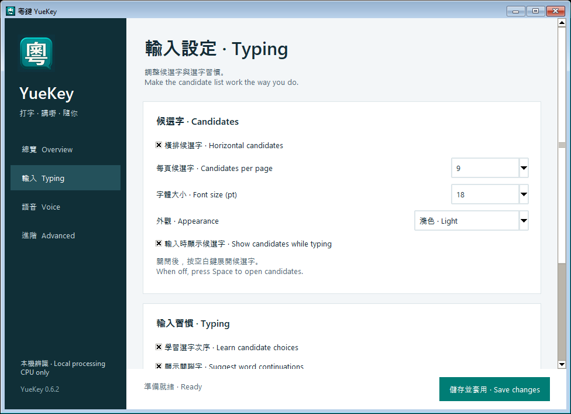

# YueKey 平台功能 · Platform features

三個平台共用速成碼表、廣東話關聯字資料及語音模型；桌面整合按各平台處理。

All three platforms share the Quick mappings, Cantonese continuation data and speech models, with integration for each desktop.

| 功能 · Feature | GNOME / IBus | KDE / Fcitx5 | Windows / Weasel |
|---|---|---|---|
| 總覽／輸入／語音／進階四頁介面 · Four-page settings layout | GTK | GTK | Windows companion |
| 港式速成、香港用字 · Quick and HK characters | ✓ | ✓ | ✓ |
| 預設及唯一方案，毋須 F4 · Quick by default, no F4 selection | ✓ | ✓ | ✓ |
| `zb1` → `，`, `zd1` → `。` | ✓ | ✓ | ✓ |
| 個人學習及備份重設 · Learning and backed-up reset | ✓ | ✓ | ✓ |
| 廣東話關聯字 · Cantonese continuations | Native Rime module | Native Rime module | Rime Lua processor |
| 關聯字只在清單，選取後輸入 · Continuations stay in the list until selected | ✓ | ✓ | ✓ |
| 橫／直排、字體、主題 · Layout, font, theme | GNOME extension | Fcitx5 Classic UI | Weasel schema style |
| 候選字顯示、每頁字數 · Candidate visibility/page size | ✓ | ✓ | ✓ |
| 中英切換及標點偏好 · Language key/punctuation | ✓ | ✓ | ✓ |
| 純 CPU 廣東話語音 · CPU Cantonese speech | ✓ | ✓ | ✓ |
| 連按兩次 Ctrl、Esc 取消 · Double Ctrl / Esc | ✓ | ✓ | ✓ |
| 麥克風選擇、音量提示 · Microphone selection/indicator | PipeWire | PipeWire | PortAudio |
| 收音狀態、原欄位插入 · Status/targeted insertion | IBus + Shell | Fcitx5 event loop | UI Automation + Unicode input |
| 輸入位置旁的小語音提示 · Small indicator near input | Caret / accessible field | Native input panel | Caret / UIA field |
| 登入啟動 · Login startup | Enabled with speech | Enabled with speech | Optional installer task |
| 安裝檔 · Installer | All-in-one DEB | Same all-in-one DEB | Setup EXE / ZIP |
| CPU 架構 · Architectures | amd64 / arm64 | amd64 / arm64 | x64 / x86 / arm64 |
| 語音模型 · Speech models | Bundled | Bundled | Download on first setup |

0.6.7 起，三個平台使用相同的深綠導覽列、四頁版面、卡片及儲存按鈕；共用配色和頁面標題定義。原生視窗邊框、控制項與平台啟用步驟按系統處理。

Since 0.6.7, all platforms use the same sidebar, four-page layout, cards and Save changes action, sharing palette and page-title definitions. Native window borders, controls and activation steps follow the platform.

設定介面：Linux 執行 `quick-hk configure`；Windows 開啟 YueKey 的 Typing／Voice 分頁。兩者共用全部 13 項偏好：橫排、每頁字數、字體大小、候選字顯示、主題、學習、關聯字、半形標點、中英切換鍵、語音啟用、語音快捷鍵、麥克風及自動標點。主題與按鍵選項使用相同中英名稱。

Open settings with `quick-hk configure` on Linux or YueKey's Typing/Voice pages on Windows. Both expose all 13 shared preferences: horizontal layout, page size, font size, candidate visibility, theme, learning, continuations, ASCII punctuation, language key, speech enabled, speech key, microphone and automatic punctuation. Theme and key choices use the same bilingual labels.

## 設定選項核對 · Settings menu audit

以下全部選項在 Ubuntu、Kubuntu 及 Windows 均提供。標籤、選單值及數值範圍共用定義；預設值來自同一個設定模型。升級會保留你的已儲存偏好。

Every option below is available on Ubuntu, Kubuntu and Windows. Labels, choices and numeric ranges share definitions, and defaults come from one settings model. Upgrades preserve saved preferences.

| 選項 · Option | 選擇 · Choices | 預設 · Default |
|---|---|---|
| 橫排候選字 · Horizontal candidates | On / Off (vertical) | On |
| 每頁候選字 · Candidates per page | 1–9 | 9 |
| 字體大小 · Font size | 10–36 pt | 18 pt |
| 外觀 · Appearance | 淺色 Light / 深色 Dark | Light |
| 輸入時顯示候選字 · Show candidates while typing | On / Off; Space opens hidden candidates | On |
| 學習選字次序 · Learn candidate choices | On / Off | On |
| 顯示關聯字 · Suggest word continuations | On / Off | On |
| 半形標點 · ASCII punctuation | On / Off | Off |
| 中英切換鍵 · Chinese / English key | Left Shift / Right Shift / Left Ctrl / Disabled | Left Shift |
| 啟用語音輸入 · Enable dictation | On / Off | Off |
| 連按兩次 · Double-tap key | Left Ctrl / Right Ctrl | Left Ctrl |
| 麥克風 · Microphone | System default / available input devices | System default |
| 自動標點 · Automatic punctuation | On / Off | On |

Both settings windows offer **Refresh microphones**, preserve a disconnected microphone selection, and explain the Right Ctrl fallback when Left Ctrl switches language. **Save changes** and **Back up / Reset learning** use matching labels.

兩個設定視窗均提供「重新整理麥克風」，保留暫未連接的裝置選擇，並說明左 Ctrl 衝突時改用右 Ctrl。「儲存並套用」與「備份並重設學習」名稱亦一致。

The Rime scheme menu uses the same three switches: **中文 / English**, **關聯字關 / 關聯字開**, and **。， / .,**. System tray and desktop input-source menus belong to IBus, Fcitx5 or Weasel and include their own deployment, exit and system-settings commands; those menus are not identical across operating systems.

Rime 方案選單共用三個切換項：「中文／English」、「關聯字關／關聯字開」及「。，／.,」。系統匣及桌面輸入來源選單由 IBus、Fcitx5 或小狼毫提供，其部署、退出及系統設定指令會因平台而異。

Linux 使用一頁設定及「儲存並套用」；Windows 使用分頁，並以語音按鈕即時啟用／停用。Linux 安裝檔內置模型，「驗證語音模型」只作檢查；Windows 首次啟用語音時下載模型。麥克風清單來自各系統的音訊裝置，名稱可以不同。

Linux uses a single settings page with Apply; Windows uses navigation pages and an immediate voice enable/disable button. Linux bundles the models and offers Verify speech models; Windows downloads models on first enable. Microphone names come from each system's audio devices and may differ.

設定與安裝均把 Rime 的可選方案設為港式速成；其他方案檔案及學習資料保留在磁碟。移除粵鍵方案時，未經後續修改的設定會由原有備份還原。

Setup and Apply make Cantonese Quick the only selectable Rime scheme. Other schema files and learned data remain on disk. Removing YueKey typing restores unchanged managed settings from the original backup.

Rime configuration reference: [customizing the schema menu](https://github.com/rime/home/wiki/CustomizationGuide#一例定製方案選單).

## Implementation and validation

The Fcitx5 addon uses public Fcitx5 5.1.19 interfaces. It watches the active input context, secure-field capabilities and input activity on the Fcitx event loop. Only the owner of `org.quick_hk.Dictation` may configure it or submit a result. Focus, cursor, surrounding-text, input-method, capability and key changes invalidate the request. A result consumes its request before reset and commit; KDE uses neither a synthetic wake key nor the clipboard.

The Python controller selects KDE from `XDG_CURRENT_DESKTOP` or accepts `--frontend fcitx5`. It shares the existing worker lifecycle, local models and session guards. Shared Linux service/autostart files keep one original backup and remain installed while either managed frontend needs them.

Fcitx5 continuations have empty composition text. IBus 1.6 hides candidate lists for empty compositions, so its schema enables panel preedit and its frontend disables inline preedit; radicals and pending text appear in the candidate panel. Both installed frontends are checked for an unchanged text field while suggestions are visible or highlighted, explicit selection, and cancellation. [IBus 1.6 display implementation](https://github.com/rime/ibus-rime/blob/1.6.0/rime_engine.c).

Windows uses Rime Lua for continuations from the same pre-ranked TSV input as the Linux native predictor. Data loads in bounded shards; only public dictionary data is cached. No personal text is cached between input sessions. Weasel-specific style patches live in `quick_hk.windows.custom.yaml`, preserving other schemes' appearance. The Windows companion persists the shared settings model and identifies microphones by device and host-API name, resolving the current index immediately before capture.

Weasel uses `style/preedit_type: composition` with inline preedit enabled for typed radicals; continuation segments have empty preedit and appear only in the candidate list. Candidate layout writes both `style/horizontal` and `style/layout/type`; the latter takes precedence in Weasel 0.17.4. CI exercises the installed server's TSF preedit responses and its shared candidate renderer in horizontal, vertical and horizontal layouts. List-only suggestions, highlight changes, acceptance, cancellation and new-code dismissal are checked without sending input to an application. [Weasel 0.17.4 display implementation](https://github.com/rime/weasel/blob/0.17.4/RimeWithWeasel/RimeWithWeasel.cpp).

Automated checks include actual Rime candidate selection and continuation cancellation, Fcitx5 D-Bus input contexts and secure-field flags, the production KDE controller with a deterministic audio worker, Windows upgrade/preservation contracts, real Windows file locking, installer startup/repair/removal and CPU recognition of a public Cantonese WAV. Tests do not open the user's microphone.

The shared implementation covers the feature list above. This does not establish compatibility with every application: KDE XIM clients lack reliable secure-field information; Windows requires a supported UI Automation Edit/Document control at normal privilege. Hardware microphones, a full KDE Wayland session and the Windows 11 application matrix still require hands-on checks. See [compatibility.md](compatibility.md) and [dictation-validation.md](dictation-validation.md).

上述功能已在程式及安裝流程提供；測試範圍不等同所有應用程式均已驗證。KDE 的 XIM 欄位及 Windows 無法識別／較高權限欄位不支援語音。真實麥克風、完整 KDE Wayland 桌面及 Windows 11 應用程式仍需實機檢查。

API references: [Fcitx addon tutorial](https://fcitx-im.org/wiki/Develop_an_simple_input_method), [Fcitx5 5.1.19 source](https://github.com/fcitx/fcitx5/tree/5.1.19), [Weasel schema style loading](https://github.com/rime/weasel/blob/0.17.4/RimeWithWeasel/RimeWithWeasel.cpp), [Windows file sharing](https://learn.microsoft.com/en-us/windows/win32/api/fileapi/nf-fileapi-createfilew), [PortAudio device selection](https://python-sounddevice.readthedocs.io/en/latest/api/checking-hardware.html).

Architecture-specific validation and OS limits are recorded in [ARCHITECTURES.md](ARCHITECTURES.md).
